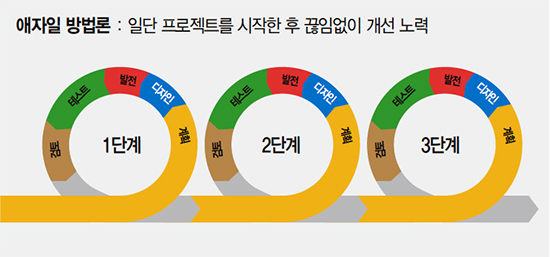
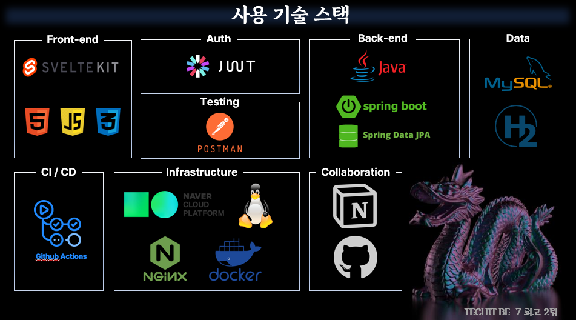
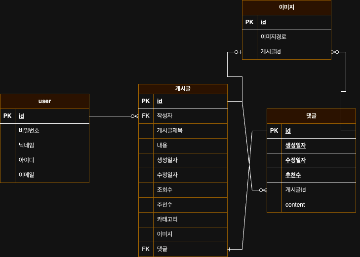

# GameDragons 프로젝트 

## 1. 프로젝트 개요

- **REST API 기반 협업으로 게시판 구현 및 배포**

### 설계 및 기획 

## 2. 사용한 기술 스택

## 3. 프로젝트 구조 

### ERD

## 4. 기능

### 구현된 기능 
- [x] 회원 CRUD
- [x] 게시글 CRUD
- [x] 댓글 CRUD

## 5. 참고사항 

 - [TroubleShooting](https://www.notion.so/3d3ce63d56f64286b8b2f4c5ee6d51cb?v=ec477b9e953e4a868e5f2415027f2074)
 - [GameDragons 배포 링크](https://gamedragons.bi3a.app/)

